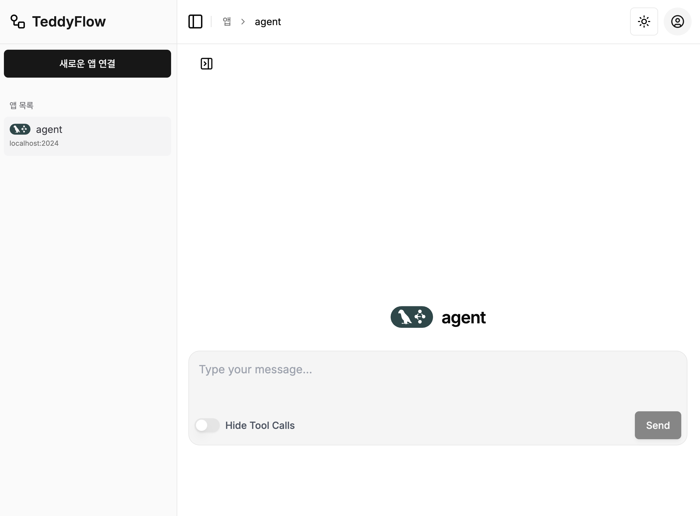
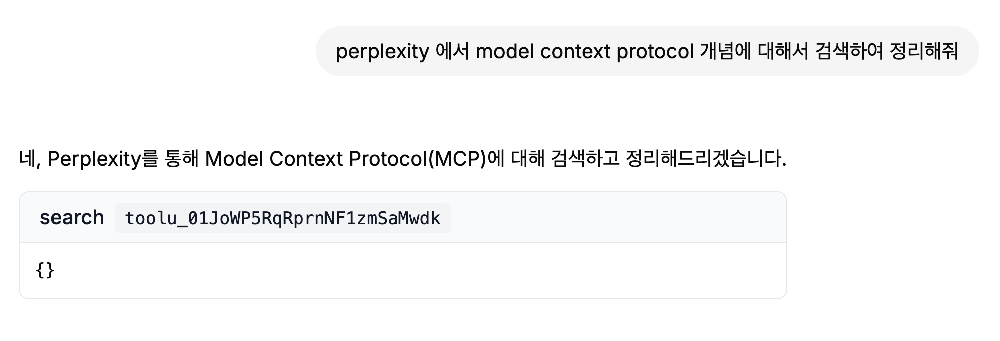
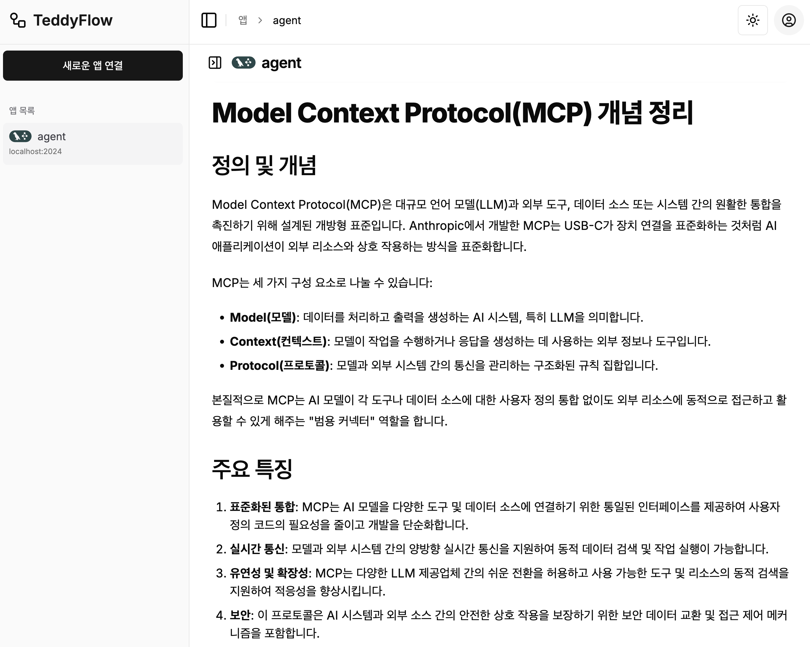
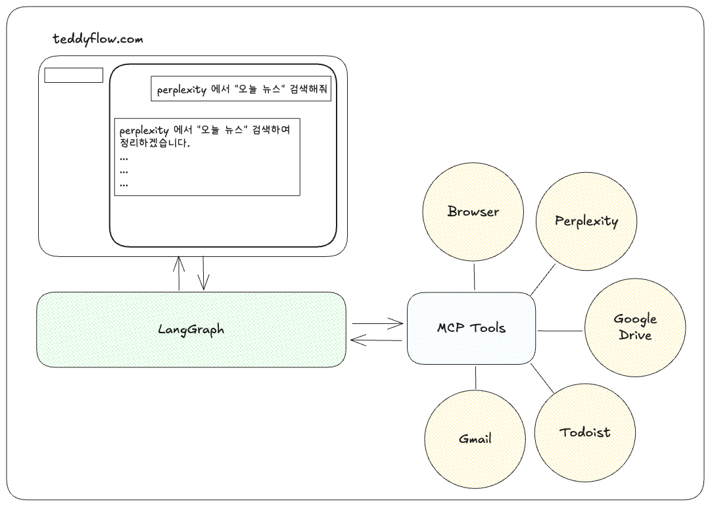
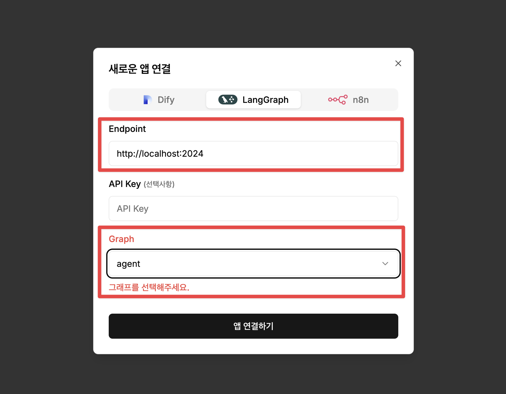
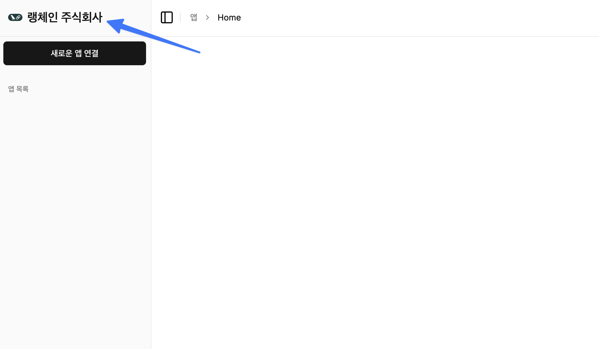

# LangGraph ReAct MCP Chat


[![Open in - LangGraph Studio](https://img.shields.io/badge/Open_in-LangGraph_Studio-00324d.svg?logo=data:image/svg%2bxml;base64,PHN2ZyB4bWxucz0iaHR0cDovL3d3dy53My5vcmcvMjAwMC9zdmciIHdpZHRoPSI4NS4zMzMiIGhlaWdodD0iODUuMzMzIiB2ZXJzaW9uPSIxLjAiIHZpZXdCb3g9IjAgMCA2NCA2NCI+PHBhdGggZD0iTTEzIDcuOGMtNi4zIDMuMS03LjEgNi4zLTYuOCAyNS43LjQgMjQuNi4zIDI0LjUgMjUuOSAyNC41QzU3LjUgNTggNTggNTcuNSA1OCAzMi4zIDU4IDcuMyA1Ni43IDYgMzIgNmMtMTIuOCAwLTE2LjEuMy0xOSAxLjhtMzcuNiAxNi42YzIuOCAyLjggMy40IDQuMiAzLjQgNy42cy0uNiA0LjgtMy40IDcuNkw0Ny4yIDQzSDE2LjhsLTMuNC0zLjRjLTQuOC00LjgtNC44LTEwLjQgMC0xNS4ybDMuNC0zLjRoMzAuNHoiLz48cGF0aCBkPSJNMTguOSAyNS42Yy0xLjEgMS4zLTEgMS43LjQgMi41LjkuNiAxLjcgMS44IDEuNyAyLjcgMCAxIC43IDIuOCAxLjYgNC4xIDEuNCAxLjkgMS40IDIuNS4zIDMuMi0xIC42LS42LjkgMS40LjkgMS41IDAgMi43LS41IDIuNy0xIDAtLjYgMS4xLS44IDIuNi0uNGwyLjYuNy0xLjgtMi45Yy01LjktOS4zLTkuNC0xMi4zLTExLjUtOS44TTM5IDI2YzAgMS4xLS45IDIuNS0yIDMuMi0yLjQgMS41LTIuNiAzLjQtLjUgNC4yLjguMyAyIDEuNyAyLjUgMy4xLjYgMS41IDEuNCAyLjMgMiAyIDEuNS0uOSAxLjItMy41LS40LTMuNS0yLjEgMC0yLjgtMi44LS44LTMuMyAxLjYtLjQgMS42LS41IDAtLjYtMS4xLS4xLTEuNS0uNi0xLjItMS42LjctMS43IDMuMy0yLjEgMy41LS41LjEuNS4yIDEuNi4zIDIuMiAwIC43LjkgMS40IDEuOSAxLjYgMi4xLjQgMi4zLTIuMy4yLTMuMi0uOC0uMy0yLTEuNy0yLjUtMy4xLTEuMS0zLTMtMy4zLTMtLjUiLz48L3N2Zz4=)](https://langgraph-studio.vercel.app/templates/open?githubUrl=https://github.com/langchain-ai/react-agent)

## 프로젝트 개요



`LangGraph ReAct MCP Chat`은 Model Context Protocol(MCP)을 통해 다양한 외부 도구와 데이터 소스에 접근할 수 있는 ReAct 에이전트를 구현한 프로젝트입니다. 이 프로젝트는 LangGraph를 기반으로 하며, MCP 도구를 쉽게 추가하고 구성할 수 있는 인터페이스를 제공합니다.

### 사용 사례






### 주요 기능

* **LangGraph ReAct 에이전트**: LangGraph를 기반으로 하는 ReAct 에이전트
* **도구 관리**: MCP 도구를 쉽게 추가, 제거, 구성 가능 (Smithery JSON 형식 지원)
* **스트리밍 응답**: 에이전트의 응답과 도구 호출을 실시간으로 확인
* **대화 기록**: 에이전트와의 대화 내용 추적 및 관리

## 아키텍처



## 설치 방법

1. 저장소 복제하기

```bash
git clone https://github.com/teddynote-lab/langgraph-react-mcp-chat.git
cd langgraph-react-mcp-chat
```

2. uv를 사용하여 가상 환경 생성 및 의존성 설치

```bash
uv venv
source .venv/bin/activate  # Windows의 경우: .venv\Scripts\activate
uv pip install -r requirements.txt
```

3. `.env` 파일 설정하기

`.env.example` 파일을 `.env`로 복사하고 필요한 API 키를 추가합니다:

```bash
cp .env.example .env
```

아래는 필요한 API 키 목록입니다:
```
ANTHROPIC_API_KEY=your_anthropic_api_key
OPENAI_API_KEY=your_openai_api_key
LANGSMITH_TRACING=true
LANGSMITH_ENDPOINT=https://api.smith.langchain.com
LANGSMITH_API_KEY=your_langsmith_api_key
LANGSMITH_PROJECT=your_langsmith_project
```

4. MCP 도구 구성하기

먼저, 예시로 작성한 `mcp_config_sample.json` 파일을 `mcp_config.json` 파일로 파일명을 변경합니다.

아래는 샘플로 작성된 예시입니다.

```json
{
    "mcpServers": {
        "desktop-commander": {
            "command": "npx",
            "args": [
                "-y",
                "@smithery/cli@latest",
                "run",
                "@wonderwhy-er/desktop-commander",
                "--key",
                "Smithery API_KEY 입력"
            ]
        },
        "perplexity-search": {
            "command": "npx",
            "args": [
                "-y",
                "@smithery/cli@latest",
                "run",
                "@arjunkmrm/perplexity-search",
                "--config",
                "{\"perplexityApiKey\":\"Perplexity API_KEY 입력\"}"
            ]
        },
        "hyperbrowser": {
            "command": "npx",
            "args": [
                "-y",
                "@smithery/cli@latest",
                "run",
                "@hyperbrowserai/mcp",
                "--key",
                "Smithery API_KEY 입력"
            ]
        },
        "todoist-mcp": {
            "command": "npx",
            "args": [
                "-y",
                "@smithery/cli@latest",
                "run",
                "@miottid/todoist-mcp",
                "--key",
                "Smithery API_KEY 입력"
            ]
        }
    }
}
```

[Smithery](https://smithery.ai/) 에서 사용할 MCP 도구의 JSON 구성을 가져와 `mcp_config.json` 파일에 추가해야 합니다

1. [Smithery](https://smithery.io) 웹사이트를 방문하여 사용하고 싶은 도구를 선택합니다.
2. 도구 페이지에서 오른쪽의 'COPY' 버튼을 클릭하여 JSON 구성을 복사합니다.
3. `mcp_config.json` 파일을 열고 복사한 JSON을 추가합니다.

**중요**: 파일 이름은 반드시 `mcp_config.json`으로 저장해야 합니다. 다른 이름을 사용할 경우 프로그램이 올바르게 작동하지 않습니다.

## 애플리케이션 실행

모든 설정이 완료되었다면, 다음 명령어로 LangGraph 개발 서버를 실행할 수 있습니다:

```bash
langgraph dev
```

서버가 성공적으로 시작되면 웹 브라우저에서 로컬 주소(일반적으로 http://localhost:3000)를 통해 애플리케이션에 접속할 수 있습니다.

## teddyflow.com 연결 방법


1. 먼저, 터미널에서 `langgraph dev` 명령어를 실행하여 개발 서버를 시작합니다.
2. teddyflow.com 에서 회원가입을 합니다.

회원가입시 "베타 키" 에 `teddynote-youtube` 를 입력하면 승인 없이 바로 가입이 가능합니다.


3. 로그인 후 "새로운 앱 연결" 버튼을 클릭합니다.


4. 앱 이름을 입력하고 "연결" 버튼을 클릭합니다.
5. 탭에서 "LangGraph" 를 선택한 뒤 다음의 정보를 입력합니다.
- Endpoint: `http://localhost:2024`
- Graph: `agent`



6. 연결 설정이 완료되면 "저장" 버튼을 클릭합니다.

7. "앱 연결하기" 버튼을 눌러 저장합니다.

## 회사명 / 커뮤니티 로고 및 브랜딩 적용

회사명 / 커뮤니티를 위한 커스텀 기능을 출시하였습니다.



도입을 희망하신다면 service@brain-crew.com 으로 문의주시면 도움을 드리겠습니다.


## 라이센스

Apache License 2.0 ([LICENSE](LICENSE))